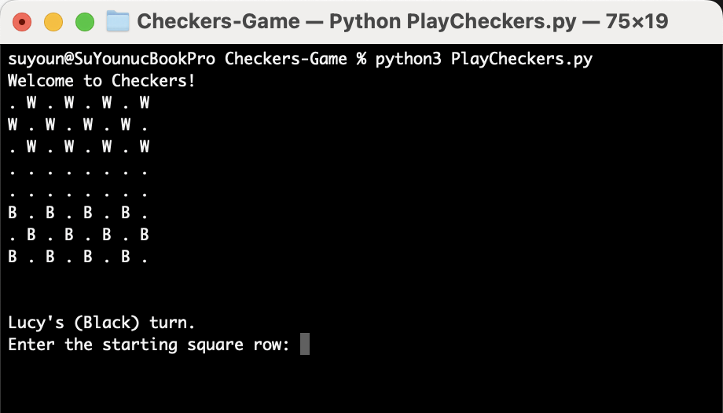
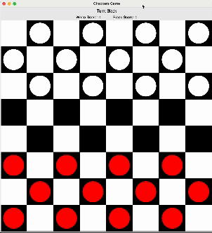

# Checkers-Game
This project implements a variation of the classic game of Checkers with modified rules. The game allows two players to compete by moving their pieces diagonally across a board, capturing opponent pieces, and promoting pieces to kings and triple kings.

## Installtion
1. **Clone the Repository:**
   ```sh
   git clone <repository-url>
   cd <repository-directory>
   ```

2. Ensure you have Python installed.
3. Install the required packages:
    ```sh
    pip install -r requirements.txt
    ```

## How to Play
### Commnad-Line Version
1. Run the Checkers game:
    ```sh
    python3 PlayCheckers.py
    ```

2. Follow the prompts to make moves.

    #### Example Ouput
    

### GUI Version
1. Run the Checkers game with GUI:
    ```sh
    python3 CheckersGUI.py
    ```

2. Use the mouse to click on a piece to select it and then click on the destination square to move it. The current turn and scores are displayed on the top.


### Video Demo


